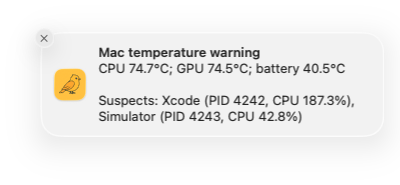
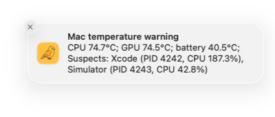
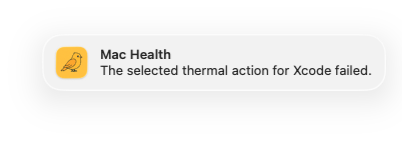
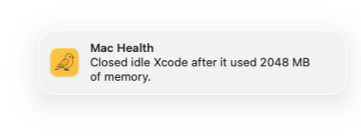
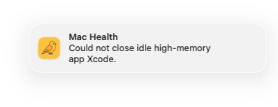
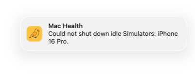
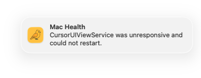
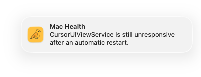
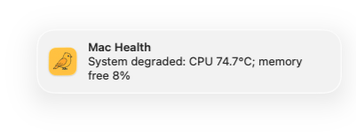
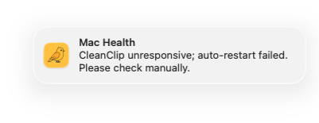

<p align="center">
  
</p>

<h1 align="center">canaryd</h1>

<p align="center">
  A quiet health monitor for your Mac.
  <br>
  It detects heat and stalled apps, then recovers them without taking your focus.
</p>

<p align="center">
  <a href="https://hex.pm/packages/canaryd"></a>
  <a href="./LICENSE"></a>
  
  
</p>

<p align="center">
  <a href="#notifications">Notifications</a> ·
  <a href="#install">Install</a> ·
  <a href="#usage">Usage</a> ·
  <a href="#how-it-works">How it works</a> ·
  <a href="#development">Development</a>
</p>

---

Canaryd is a local macOS watchdog. It uses exact Apple Silicon temperature
data, macOS responsiveness state, and a reversible clipboard probe to find
problems that a simple process check can miss.

- **Watch heat.** Detect CPU or GPU temperatures at or above 70°C and show the
  processes that correlate with the load.
- **Recover stalled apps.** Confirm that a GUI app is not responding before a
  controlled restart.
- **Reclaim idle memory.** Gracefully close an inactive third-party app after it
  stays above 1 GB RSS with low CPU use while the user is away.
- **Stop idle Simulators.** Shut down booted Simulator devices after sustained
  whole-Mac inactivity, while protecting active Xcode test runs.
- **Verify CleanClip.** Check that CleanClip records new clipboard items, not
  only that its process exists.
- **Stay quiet.** Use background restarts and Notification Center. Do not open
  a foreground alert or take input focus.
- **Keep data local.** Store state, events, and logs on the Mac.

## Status at a glance

Run `canaryd status` to see health, recent recovery events, pending app hangs,
idle Simulators, and thermal pressure.


> The screenshot contains example values. Process names, temperatures, and
> events come from your Mac.

## Notifications

Canaryd uses a native, signed `Canaryd.app` helper for Notification Center.
These are real macOS notification captures generated with representative mock
data. Successful background recovery stays quiet unless the recovery policy
explicitly reports a result.

### Thermal pressure

| First hot round | Close or Restart after confirmation |
| --- | --- |
|  |  |

| Informational fallback | Selected action failed |
| --- | --- |
|  |  |

### Automatic recovery results

| Idle app closed | Idle app could not close |
| --- | --- |
|  |  |

| Simulators shut down | Simulator shutdown failed |
| --- | --- |
|  |  |

### Attention required

| App restart failed | App hung again during cooldown |
| --- | --- |
|  |  |

| System degraded | CleanClip recovery blocked |
| --- | --- |
|  |  |

## Install

### Install with an AI agent

Give this prompt to Codex, Claude Code, Cursor, or another coding agent:

```text
Read https://raw.githubusercontent.com/ThaddeusJiang/canaryd/main/SKILL.md and follow its instructions to install or update Canaryd on this Mac.
```

### Requirements

- macOS on Apple Silicon or Intel
- Xcode Command Line Tools for the built-in notification helper
- `macmon 0.8.0` for exact CPU and GPU temperatures on Apple Silicon

The GitHub Release executable includes Erlang and Elixir. A source or Hex
installation needs Elixir 1.15 or later.

Install the system tools:

```sh
xcode-select -p >/dev/null || xcode-select --install

if [ "$(uname -m)" = "arm64" ]; then
  brew install macmon
  brew pin macmon
  macmon --version
fi
```

On Apple Silicon, the last command must print `macmon 0.8.0`. Canaryd rejects
another version until its JSON schema is verified. Intel Macs do not provide
exact CPU and GPU sensor temperatures.

### Install from GitHub Releases

Install the latest stable release:

```sh
curl -fsSL https://github.com/ThaddeusJiang/canaryd/releases/latest/download/install.sh | bash
```

The installer selects the Mac architecture, verifies SHA-256, and installs
`canaryd` in `~/.local/bin`. It adds that directory to the current shell
profile when necessary. Restart the shell or run the `source` command that the
installer prints. You can then use `canaryd` from any directory.

### Install a downloaded archive

Open the [latest GitHub Release](https://github.com/ThaddeusJiang/canaryd/releases/latest).
Download `checksums-sha256.txt` and the archive for the Mac:

| Mac | Archive |
| --- | --- |
| Apple Silicon | `canaryd-aarch64-apple-darwin.tar.gz` |
| Intel | `canaryd-x86_64-apple-darwin.tar.gz` |

Verify and install the downloaded archive:

```sh
cd "$HOME/Downloads"

if [ "$(uname -m)" = "arm64" ]; then
  archive="canaryd-aarch64-apple-darwin.tar.gz"
else
  archive="canaryd-x86_64-apple-darwin.tar.gz"
fi

grep " $archive\$" checksums-sha256.txt | shasum -a 256 -c -
tar -xzf "$archive"
mkdir -p "$HOME/.local/bin"

# Run this only after the checksum succeeds. The first releases are not notarized.
xattr -d com.apple.quarantine canaryd 2>/dev/null || true
install -m 755 canaryd "$HOME/.local/bin/canaryd"
```

Add the install directory to `PATH` if the shell cannot find `canaryd`:

```sh
export PATH="$HOME/.local/bin:$PATH"
```

Add that line to the shell profile to keep the setting.

The first GitHub releases use ad hoc code signing. They do not use Apple
notarization. The checksum verifies that the download matches the release
asset. It does not provide an Apple developer identity.

### Install the current source

Use this method for the features documented in this repository:

```sh
git clone https://github.com/ThaddeusJiang/canaryd.git
cd canaryd
mix deps.get
mix escript.build
mix escript.install --force ./canaryd
```

### Install the published release

The Hex package remains available for systems that already have Elixir:

```sh
mix escript.install hex canaryd 0.1.0
```

Add the Mix escript directory to `PATH` if the shell cannot find `canaryd`:

```sh
export PATH="$HOME/.mix/escripts:$PATH"
```

Add that line to the shell profile to keep the setting.

### First run

```sh
canaryd status
```

The first command installs two launchd agents:

| Agent | Interval | Work |
| --- | ---: | --- |
| Thermal check | 1 minute | Read temperature and find high-CPU processes |
| Full health check | 5 minutes | Check the system, GUI apps, idle memory, Simulators, and CleanClip |

Every command verifies these agents. If an agent is missing, Canaryd creates it
again. You do not need to manage plist files.

## Usage

| Command | Purpose |
| --- | --- |
| `canaryd status` | Show the current health snapshot and recent events |
| `canaryd check` | Run one full health check now |
| `canaryd thermal-check` | Run one thermal and high-CPU process check now |
| `canaryd history [target]` | Show events for `cleanclip`, `system`, `thermal`, `memory`, `simulators`, or `apps` |
| `canaryd install` | Reinstall and load both launchd agents |
| `canaryd uninstall` | Remove both launchd agents and the notification helper |
| `canaryd --version` | Show the installed version without changing launchd agents |

Examples:

```sh
canaryd check
canaryd history thermal
canaryd history memory
canaryd history simulators
canaryd history apps
```

## How it works

Canaryd applies a confirmation and cooldown policy before it changes another
app.

| Signal | Detection | Response |
| --- | --- | --- |
| CPU or GPU heat | Three `macmon` samples; keep the highest average | Notify on the first hot round; offer an action after the same safe app leads two rounds |
| GUI app hang | Read the state that macOS uses in Force Quit | Confirm twice, then restart a supported third-party app |
| Idle high memory | Aggregate app RSS and CPU while the user is away | Confirm three times, then request a graceful close |
| Idle Simulator | Combine whole-Mac inactivity with CoreSimulator device age | Confirm three times, then shut down the exact booted device |
| CleanClip process | Check the process with `pgrep` | Restart it in the background when it is missing |
| CleanClip function | Write a reversible clipboard marker and verify a new history entry | Restore the clipboard, then restart CleanClip after a failed probe |
| System pressure | Read thermal throttling, load, and memory pressure | Warn after three consecutive full checks |

### Safety rules

- Canaryd never treats battery temperature as CPU or GPU temperature.
- A user clipboard change always takes priority over probe restoration.
- A third-party GUI app must fail two consecutive checks before restart.
- Apple apps, system daemons, active apps, and unsafe helper processes do not
  get automatic actions.
- An idle-memory app must remain above 1 GB RSS and at or below 1% CPU for three
  checks after 30 minutes of user inactivity.
- Idle-memory recovery requests a graceful close and never escalates to
  `SIGKILL`.
- Simulator recovery never erases or deletes a device and pauses while a
  current-user `xcodebuild` or `xctest` process is active.
- Each app has a one-hour restart, prompt, or close cooldown.
- Automatic termination can interrupt background work or expose an unsaved
  changes prompt.

When the Mac is idle for more than 30 minutes, Canaryd skips the CleanClip
functional probe. It still checks the system, GUI responsiveness, and idle
high-memory apps and Simulators.

<details>
<summary><strong>Detailed recovery policy</strong></summary>

### Thermal pressure

Canaryd keeps the highest CPU and GPU average from a three-sample window. A CPU
or GPU temperature of at least 70°C causes thermal pressure. Battery temperature
stays separate and does not represent chip temperature.

The first hot round sends a warning that stays in Notification Center until the
user dismisses it. The warning has a 15-minute cooldown for each leading
process. Canaryd lists up to five processes that use at least 20% CPU. CPU use
is correlation evidence. It is not exact heat attribution.

After the same safe third-party app leads two rounds, the notification offers
Close and Restart. Dismissal or timeout means Ignore. Canaryd does not activate
the app or take mouse focus. Apple apps, system services, nested helper apps,
and processes without a safe app bundle never get these actions. Each app has a
one-hour prompt cooldown.

### Idle memory recovery

During the five-minute full check, Canaryd aggregates RSS and CPU use for every
current-user process inside a registered top-level app bundle. After the user
has been inactive for 30 minutes, a non-active third-party app becomes a
candidate when it uses at least 1 GB RSS and at most 1% aggregate CPU for three
consecutive checks.

Canaryd then asks macOS to terminate the app gracefully and sends a Notification
Center result. It does not force-kill an app that refuses or remains open.
Apple apps, system paths, command-line daemons, nested helper bundles, other
users' processes, and the active application are protected. The same app has a
one-hour close cooldown.

### GUI app recovery

Canaryd uses the same responsiveness state that macOS shows in Force Quit. A
third-party app must be not responding in two consecutive rounds. Canaryd then
stops and opens the app in the background. Each app has a one-hour restart
cooldown.

The Force Quit state has no public macOS API. Canaryd resolves the interface at
runtime. If a future macOS release removes it, the scan becomes unavailable and
Canaryd does not stop an app.

`CursorUIViewService` is an explicitly supported Apple text-input service.
After two failed rounds, Canaryd quietly stops the current instance and waits
for launchd or an XPC client to start a new one. Successful recovery does not
send a notification. A failed restart or another confirmed hang during the
one-hour restart cooldown still sends a warning.

### Idle Simulator shutdown

During the five-minute full check, Canaryd considers booted Simulator devices
only after the user has been inactive for 30 minutes. A device must also have a
CoreSimulator `lastUsedAt` age of at least 30 minutes and remain eligible for
three consecutive checks. This makes the earliest shutdown roughly 40 minutes
after both inactivity conditions begin.

Current-user `xcodebuild` and `xctest` processes reset confirmation so
unattended Xcode test runs are protected. Before shutdown, Canaryd checks user
inactivity and automation again, then revalidates the exact UDID and timestamp.
It runs only `simctl shutdown <UDID>`; it never erases, deletes, or resets the
device. Successful and failed shutdowns are recorded locally and reported in a
batched Notification Center message.

### CleanClip recovery

The functional probe saves every pasteboard item and data type. It restores the
snapshot only when no newer pasteboard write occurred. A user copy during the
probe always wins.

A probe failure causes a quiet restart with a one-hour cooldown. Three
consecutive failures during the cooldown set the target to `blocked` and send a
notification. Canaryd records recovery automatically.

</details>

## Local data

Canaryd stores all runtime data in:

```text
~/Library/Application Support/canaryd/
├── state.dets
├── events.dets
├── stdout.log
└── stderr.log
```

`state.dets` contains the latest state-machine snapshot. `events.dets` contains
the event history for app, thermal, system, and probe actions. The log files
contain launchd output.

## Uninstall

Remove the launchd agents and the notification helper:

```sh
canaryd uninstall
```

To remove the saved state and logs too:

```sh
rm -r "$HOME/Library/Application Support/canaryd"
```

## Development

```sh
git clone https://github.com/ThaddeusJiang/canaryd.git
cd canaryd
mix deps.get
mix test
mix escript.build
```

Build the native single executable with Zig 0.16.0:

```sh
mise install zig@0.16.0
BURRITO_TARGET=macos_arm64 MIX_ENV=prod mise exec zig@0.16.0 -- mix release --overwrite
./burrito_out/canaryd_macos_arm64 --version
```

The project uses pure Elixir/OTP, DETS storage, launchd, and a small Swift
notification helper.

## License

[MIT](./LICENSE)
