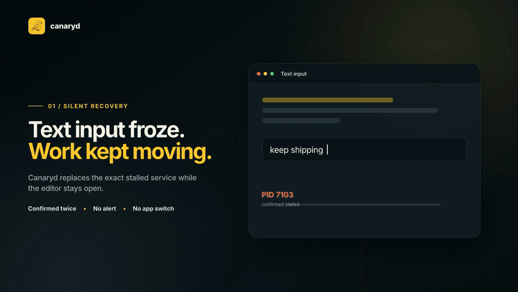
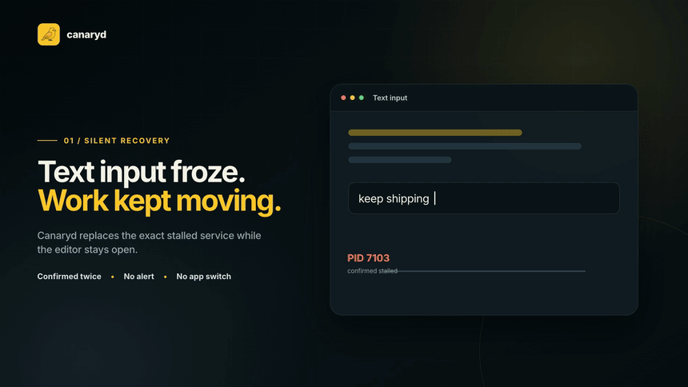
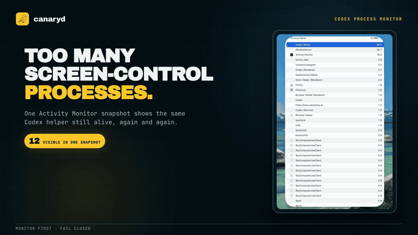
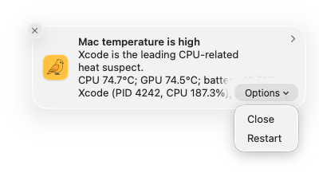
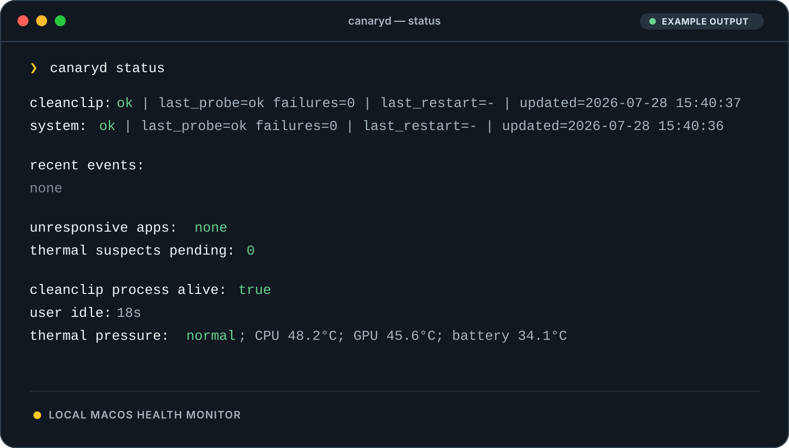

<p align="center">
  
</p>

<h1 align="center">canaryd</h1>

<p align="center">
  A quiet health monitor for developer Macs.
  <br>
  It catches stalled services, forgotten Simulators and screen-control helpers,
  silent utilities, heat, idle memory, and stale build output — then recovers
  what it safely can.
</p>

<p align="center">
  <a href="https://hex.pm/packages/canaryd"></a>
  <a href="./LICENSE"></a>
  
  
</p>

<p align="center">
  <a href="#why-canaryd-exists">Stories</a> ·
  <a href="#status-at-a-glance">Status</a> ·
  <a href="#install">Install</a> ·
  <a href="#commands">Commands</a> ·
  <a href="#safety-model">Safety</a>
</p>

<!-- readme-video:start -->
<p align="center">
  <a href="./hyperframes-src/canaryd-core-stories/output/publish/canaryd-core-stories.mp4?raw=1" data-poster="./hyperframes-src/canaryd-core-stories/output/publish/poster.png">
    
  </a>
  <br>
  <sub>The 20-second story reel plays inline. Click it for the MP4.</sub>
</p>
<!-- readme-video:end -->

---

Canaryd is a local macOS watchdog. Every five minutes it checks real system and
application behavior; once a day it reclaims validated stale build output. It
confirms suspicious state before acting and keeps successful background
recovery quiet. State, events, and logs stay on the Mac.

## Why Canaryd exists

### 1. `CursorUIViewService` hangs again

`CursorUIViewService` is an Apple text-input XPC service. Despite its name, it
is unrelated to the Cursor editor. When the service stalls, macOS marks it as
Not Responding and ordinary process-liveness checks still see a running PID.

On one developer Mac, Canaryd recorded eight confirmed hangs and eight
successful recoveries in a day. Canaryd matches the exact Apple service
identity, confirms the hang twice, stops only the stale instance, and waits for
a replacement PID. It does not restart the editor, switch apps, or show a
foreground alert.

<!-- readme-video:start -->
<p align="center">
  <a href="./hyperframes-src/canaryd-core-stories/output/publish/stories/cursoruiviewservice-recovery/cursoruiviewservice-recovery.mp4?raw=1" data-poster="./hyperframes-src/canaryd-core-stories/output/publish/frames/cursoruiviewservice-recovery.png">
    
  </a>
  <br>
  <sub>The recovery story plays inline. Click it for the MP4.</sub>
</p>
<!-- readme-video:end -->

### 2. An AI agent finishes, but its Simulators keep running

An AI coding agent can build and test several iOS device profiles, then leave
the booted Simulators behind after the task ends. One real investigation found
three booted devices that had been running for 15 hours to more than a day,
with 742 processes across their Simulator trees.

Canaryd waits for sustained inactivity, pauses while the current user has an
active `xcodebuild` or `xctest` process, and revalidates the exact device before
running `simctl shutdown <UDID>`. It never erases, deletes, or resets the device
or its data.

<!-- readme-video:start -->
<p align="center">
  <a href="./hyperframes-src/canaryd-core-stories/output/publish/stories/idle-simulators/idle-simulators.mp4?raw=1" data-poster="./docs/assets/notifications/simulators-shut-down.png">
    
  </a>
  <br>
  <sub>The idle-Simulator story plays inline. Click it for the MP4.</sub>
</p>
<!-- readme-video:end -->

<p align="center">
  
  <br>
  <sub>Representative capture from macOS Notification Center.</sub>
</p>

### 3. Codex screen-control helpers multiply

A real Activity Monitor snapshot showed twelve visible `SkyComputerUseClient`
processes at once. A broad name-based cleanup would be easy to write, but it
could terminate helpers that still belong to active work.

Canaryd waits for 30 minutes of whole-Mac inactivity and requires the same
supported process identity across three consecutive five-minute checks. Before
acting, it rechecks inactivity plus the exact process kind, PID, and start time,
then sends `SIGTERM` only. It never uses `pkill`, a name-only target, or
`SIGKILL`.

<!-- readme-video:start -->
<p align="center">
  <a href="./hyperframes-src/codex-screen-control-cleanup/output/codex-screen-control-cleanup.mp4?raw=1" data-poster="./hyperframes-src/codex-screen-control-cleanup/output/poster.png">
    
  </a>
  <br>
  <sub>The 17.5-second demo plays inline. Click it for the MP4 with sound. The cleanup sequence is controlled.</sub>
</p>
<!-- readme-video:end -->

### 4. CleanClip is alive, but it stopped recording

In a real failure, CleanClip stayed running with 0% CPU and no crash report,
but its clipboard history had not changed for more than two days. New copy
operations were no longer recorded. A process check said healthy; the feature
was dead.

Canaryd replays the latest usable real CleanClip history item and verifies that
matching content appears in history. It saves every current pasteboard item and
data type first. If the user copies something during the probe, the newer user
content always wins. A failed probe triggers a quiet restart.

<!-- readme-video:start -->
<p align="center">
  <a href="./hyperframes-src/canaryd-core-stories/output/publish/stories/cleanclip-functional-probe/cleanclip-functional-probe.mp4?raw=1" data-poster="./hyperframes-src/canaryd-core-stories/output/publish/frames/cleanclip-functional-probe.png">
    
  </a>
  <br>
  <sub>The functional-health story plays inline. Click it for the MP4.</sub>
</p>
<!-- readme-video:end -->

### 5. An AI coding session heats the Mac

Xcode can keep indexing, compiling, or running build services long after the
developer expected the expensive work to finish. Simulator processes can add
more load at the same time. The result is a familiar developer-Mac problem:
high CPU use, rising temperature, and no clear answer about which process is
driving it.

On Apple Silicon, Canaryd takes three `macmon 0.8.0` samples and keeps the
highest CPU and GPU average. It also checks thermal throttling and system load,
then lists up to five processes using at least 20% CPU. A safe top-level app can
receive Close and Restart actions; a runtime or system process is reported as
a suspect without an automatic action. CPU use is correlation evidence, not
exact heat attribution.

<!-- readme-video:start -->
<p align="center">
  <a href="./hyperframes-src/canaryd-core-stories/output/publish/stories/thermal-pressure/thermal-pressure.mp4?raw=1" data-poster="./docs/assets/notifications/thermal-action.png">
    
  </a>
  <br>
  <sub>The thermal-pressure story plays inline. Click it for the MP4.</sub>
</p>
<!-- readme-video:end -->

<p align="center">
  
  <br>
  <sub>Representative capture from macOS Notification Center.</sub>
</p>

### 6. Work is over, but a memory-heavy app is still open

Developer tools often use several processes, so one quiet application can hold
far more memory than its main PID suggests. During one investigation, a
Nowledge Mem background server stayed around 1 GB RSS and frequently fell to
0% CPU. Browser-style tools such as Dia and ChatGPT showed the same multi-process
shape. These are typical candidates after the user walks away, not while they
are active workspaces.

Canaryd aggregates an application's process tree. After 30 minutes of user
inactivity, a non-active third-party app becomes eligible only when it stays at
or above 1 GB RSS and at or below 1% CPU for three consecutive checks. Canaryd
then requests a graceful close. It protects the active app, Apple apps, system
processes, and helper bundles, and never escalates this recovery to `SIGKILL`.

<!-- readme-video:start -->
<p align="center">
  <a href="./hyperframes-src/canaryd-core-stories/output/publish/stories/idle-memory-recovery/idle-memory-recovery.mp4?raw=1" data-poster="./hyperframes-src/canaryd-core-stories/output/publish/frames/idle-memory-recovery.png">
    
  </a>
  <br>
  <sub>The idle-memory story plays inline. Click it for the MP4. It is based on a real high-memory candidate.</sub>
</p>
<!-- readme-video:end -->

### 7. AI agents finish, but their build output stays

Parallel coding agents can leave Xcode DerivedData and Cargo `target/`
directories across projects and worktrees after their tasks are complete. The
source may already be committed while reproducible build output continues to
consume disk space.

At 04:00 local time, Canaryd checks fixed safe roots, validates every candidate,
and requires the complete directory tree to be untouched for seven days. It
skips Xcode cleanup while Xcode, Simulator, `xcodebuild`, or `xctest` is active,
and skips Rust cleanup while `cargo` or `rustc` is active. It never follows
symbolic links or removes source, Archives, Simulator data, or Cargo caches.

<!-- readme-video:start -->
<p align="center">
  <a href="./hyperframes-src/canaryd-core-stories/output/publish/stories/stale-build-cleanup/stale-build-cleanup.mp4?raw=1" data-poster="./hyperframes-src/canaryd-core-stories/output/publish/frames/stale-build-cleanup.png">
    
  </a>
  <br>
  <sub>The build-cleanup story plays inline. Click it for the MP4. It follows the maintained cleanup specification.</sub>
</p>
<!-- readme-video:end -->

## Status at a glance

Run `canaryd status` to see current temperatures, CleanClip health, recent
recovery events, pending app hangs, idle high-memory apps, idle Simulators, and
idle Codex screen-control helpers.



> The screenshot contains representative values. Process names, temperatures,
> and events come from the current Mac.

## Install

### Install with an AI agent

Give this prompt to Codex, Claude Code, Cursor, or another coding agent:

```text
Read https://raw.githubusercontent.com/ThaddeusJiang/canaryd/main/SKILL.md and follow its instructions to install or update Canaryd on this Mac.
```

### Requirements

- macOS on Apple Silicon or Intel
- Xcode Command Line Tools for the native notification helper
- `macmon 0.8.0` for exact CPU and GPU temperatures on Apple Silicon

The GitHub Release executable includes Erlang and Elixir. A source or Hex
installation needs Elixir 1.15 or later.

Install the system tools:

```sh
xcode-select -p >/dev/null || xcode-select --install

if [ "$(uname -m)" = "arm64" ]; then
  brew install macmon
  brew pin macmon
  macmon --version
fi
```

On Apple Silicon, the last command must print `macmon 0.8.0`. Canaryd rejects
another version until its JSON schema is verified. Intel Macs do not provide
exact CPU and GPU sensor temperatures.

### Install the latest stable release

```sh
curl -fsSL https://github.com/ThaddeusJiang/canaryd/releases/latest/download/install.sh | bash
```

The installer selects the Mac architecture, verifies SHA-256, and installs
`canaryd` in `~/.local/bin`. It adds that directory to the current shell profile
when necessary.

Restart the shell, or run the `source` command printed by the installer, then:

```sh
canaryd status
```

The first command installs two launchd agents:

| Agent | Schedule | Work |
| --- | ---: | --- |
| Full health check | Every 5 minutes | Check temperature, high-CPU processes, the system, GUI apps, idle memory, Simulators, Codex screen-control helpers, and CleanClip |
| Build cleanup | Daily at 04:00 | Remove validated Xcode DerivedData and Cargo target directories inactive for seven days |

Every later command verifies and repairs both agents when necessary. You do
not need to manage plist files.

<details>
<summary><strong>Manual archive, source, and Hex installation</strong></summary>

### Install a downloaded archive

Open the [latest GitHub Release](https://github.com/ThaddeusJiang/canaryd/releases/latest)
and download `checksums-sha256.txt` plus the archive for the Mac:

| Mac | Archive |
| --- | --- |
| Apple Silicon | `canaryd-aarch64-apple-darwin.tar.gz` |
| Intel | `canaryd-x86_64-apple-darwin.tar.gz` |

Verify and install it:

```sh
cd "$HOME/Downloads"

if [ "$(uname -m)" = "arm64" ]; then
  archive="canaryd-aarch64-apple-darwin.tar.gz"
else
  archive="canaryd-x86_64-apple-darwin.tar.gz"
fi

grep " $archive\$" checksums-sha256.txt | shasum -a 256 -c -
tar -xzf "$archive"
mkdir -p "$HOME/.local/bin"

# Run this only after the checksum succeeds. Current releases are not notarized.
xattr -d com.apple.quarantine canaryd 2>/dev/null || true
install -m 755 canaryd "$HOME/.local/bin/canaryd"
```

Current releases use ad hoc code signing and are not Apple-notarized. The
checksum verifies the downloaded release asset; it does not provide an Apple
Developer ID identity.

### Install the current source

```sh
git clone https://github.com/ThaddeusJiang/canaryd.git
cd canaryd
mix deps.get
mix escript.build
mix escript.install --force ./canaryd
```

### Install the published Hex release

```sh
mix escript.install hex canaryd 0.4.5
```

Add the relevant install directory to `PATH` if the shell cannot find
`canaryd`:

```sh
export PATH="$HOME/.local/bin:$HOME/.mix/escripts:$PATH"
```

</details>

## Commands

| Command | Purpose |
| --- | --- |
| `canaryd status` | Show the current health snapshot and recent events |
| `canaryd check` | Run one full health check now |
| `canaryd thermal-check` | Run one thermal and high-CPU process check now |
| `canaryd clean` | Remove stale Xcode DerivedData and Cargo target directories now |
| `canaryd history [target]` | Show events for `cleanclip`, `system`, `thermal`, `memory`, `simulators`, `codex`, `builds`, or `apps` |
| `canaryd install` | Reinstall and load the launchd agents |
| `canaryd uninstall` | Remove the launchd agents and the notification helper |
| `canaryd --version` | Show the installed version without changing the launchd agents |

Examples:

```sh
canaryd check
canaryd history thermal
canaryd history memory
canaryd history simulators
canaryd history codex
canaryd history builds
canaryd history apps
```

## Safety model

Canaryd confirms abnormal behavior before changing another process.

| Signal | Confirmation | Response |
| --- | --- | --- |
| CPU or GPU heat | Three temperature samples; two rounds for the same actionable leader | Warn first, then offer Close or Restart |
| GUI app hang | macOS Not Responding state in two consecutive rounds | Restart a supported third-party app in the background |
| Idle high memory | 30 minutes of user inactivity and three low-CPU, 1 GB+ rounds | Request a graceful app close |
| Idle Simulator | Sustained inactivity and three unchanged device observations | Shut down the exact booted UDID |
| Idle Codex screen control | 30 minutes of user inactivity and three unchanged process observations | Send `SIGTERM` to the revalidated exact PID |
| Stale build output | Complete tree inactive for seven days and related tools idle | Remove a validated DerivedData or Cargo target directory |
| CleanClip process missing | Process check | Start it in the background |
| CleanClip function missing | Reversible real-history probe | Restart quietly; notify only when recovery is blocked |
| System pressure | Three consecutive full checks | Send one system-degraded notification |

The shared safety rules are:

- Battery temperature never substitutes for CPU or GPU temperature.
- CPU use identifies suspects; it does not prove exact heat attribution.
- Apple apps, system daemons, active apps, and unsafe helper processes are
  protected from general automatic actions.
- A newer user clipboard write always wins over CleanClip probe restoration.
- Idle-memory recovery never uses `SIGKILL`.
- Simulator recovery never runs `erase`, `delete`, `reset`, or `shutdown all`.
- Active current-user `xcodebuild` and `xctest` processes block Simulator
  shutdown.
- Codex helper cleanup matches only fixed Computer Use, `node_repl`,
  `unified-computer-use`, and `cua-driver mcp` signatures. It protects
  `cua-driver serve`, unrelated Node.js processes, and the Codex app server.
- Codex helper cleanup revalidates an exact PID, sends only `SIGTERM`, and never
  stores the command line used for classification.
- Build cleanup pauses while related Xcode or Rust tools are active and removes
  only validated, reproducible directories whose complete trees are at least
  seven days old.
- Build cleanup never removes Xcode Archives, DeviceSupport, SDKs, UserData,
  Simulator data, Cargo registry or git caches, installed binaries, or source.
- App restart, prompt, and close actions use one-hour cooldowns.
- Automatic termination can still interrupt background work or expose an
  unsaved-changes prompt.

For exact behavior, see the maintained feature specifications:

- [Unresponsive app recovery](./docs/specs/001-unresponsive-app-recovery.md)
- [CleanClip functional health probe](./docs/specs/002-cleanclip-health-probe.md)
- [Thermal process monitor](./docs/specs/003-thermal-process-monitor.md)
- [Idle memory process monitor](./docs/specs/007-idle-memory-process-monitor.md)
- [Idle Simulator shutdown](./docs/specs/008-idle-simulator-shutdown.md)
- [Stale build cleanup](./docs/specs/009-stale-build-cleanup.md)
- [Idle Codex process cleanup](./docs/specs/010-idle-codex-process-cleanup.md)

## Local data

Canaryd stores runtime data only on the Mac:

```text
~/Library/Application Support/canaryd/
├── state.dets
├── events.dets
├── stdout.log
└── stderr.log
```

`state.dets` contains current confirmation and cooldown state. `events.dets`
contains the local recovery timeline, including build-cleanup actions. The log
files contain launchd output. Canaryd does not store document content or process
command-line arguments in its event history.

## Uninstall

Remove the launchd agents and the notification helper:

```sh
canaryd uninstall
```

To remove saved state and logs too:

```sh
rm -r "$HOME/Library/Application Support/canaryd"
```

## Development

```sh
git clone https://github.com/ThaddeusJiang/canaryd.git
cd canaryd
mix deps.get
mix test
mix escript.build
```

Build the native executable with Zig 0.16.0:

```sh
mise install zig@0.16.0
BURRITO_TARGET=macos_arm64 MIX_ENV=prod mise exec zig@0.16.0 -- mix release --overwrite
./burrito_out/canaryd_macos_arm64 --version
```

The project uses Elixir/OTP, DETS storage, launchd, and a small Swift
notification helper.

Node.js 24 or later is required only when regenerating the HyperFrames story
media under `hyperframes-src/`.

## License

[MIT](./LICENSE)
